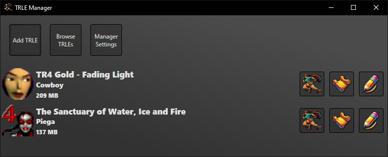
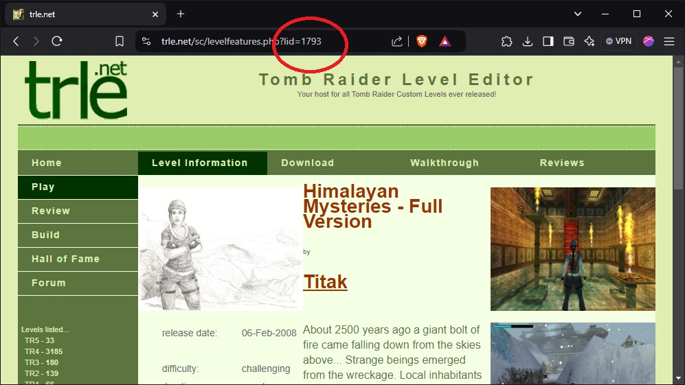
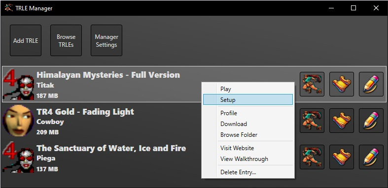

# About TRLEManager

TRLE stands for Tomb Raider Level Editor. These are custom Tomb Raider maps built in the classic style.

This manager makes it easy to download, install, and play TRLE games. Keep your TRLEs organized and remove old TRLEs you don't play anymore to free up space.

In addition, this manager provides gamepad support for TRLEs running under the manager. With inspiration drawn from the Tomb Raider I-III Remaster, weapon selection, quick saving and loading has been emulated in the same manner. The gamepad is implemented by simulating key presses. You may fully customize the gamepad to your liking.

Currently, the manager supports downloading from TRLE.net using the TRLE.net ID and TRCustoms.org using the TRCustoms ID. Simply enter the ID into the appropriate field, install, and play the TRLE with controller support!

## Installing a TRLE

### NOTE: Due to inconsistencies in the packages provided by various developers, some TRLEs will need their settings adjusted to work properly.

### <ins>1. Locate the TRLE.net ID</ins>

Visit [TRLE.net](https://trle.net) or [TRCustoms.org](https://trcustoms.org) and search for a game.

Once on the information page, the TRLE.net ID or TRCustoms.org ID is given in the address bar.

For example: **Himalayan Mysteries by Titak has a TRLE.net ID of <ins>1793</ins>**

### <ins>2. Add the TRLE</ins>

On the Main Window, click **Add TRLE**

1 - Enter the TRLE.net ID and press Enter or click Lookup  
2 - Observe the TRLE information populating  
3 - Install the TRLE  
4 - Click OK to save your changes  

### <ins>3. Setup TRLE</ins>

You can right click entries in the TRLE list to find various options, **including running the setup so you can set your screen resolutions and other settings**.

### <ins>4. Setup Gamepad Controller</ins>

Clicking **Manger Settings** on the Main Window will bring up the settings where you can adjust your gamepad or key presses sent to the game.

Click on a gamepad button to remap it to a gamepad button or change it's non-shifted function. Double click the text fields to enter a new value. An ellipse (...) means the program is waiting for your input.

The Keyboard controls can be remapped to most keyboard button presses for any additional functionality you might be interested in. Double click the text fields and press the key you want to remap that function to.

### <ins>5. Play TRLE</ins>

Click on the running raider icon to play the TRLE and enjoy! 